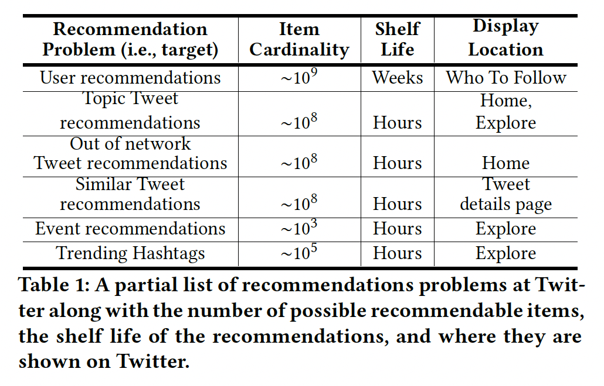
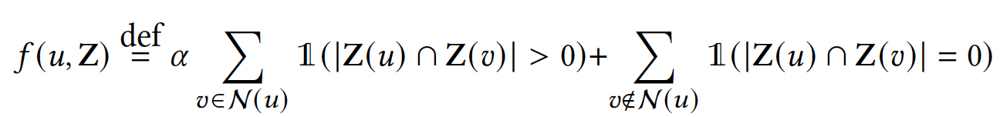
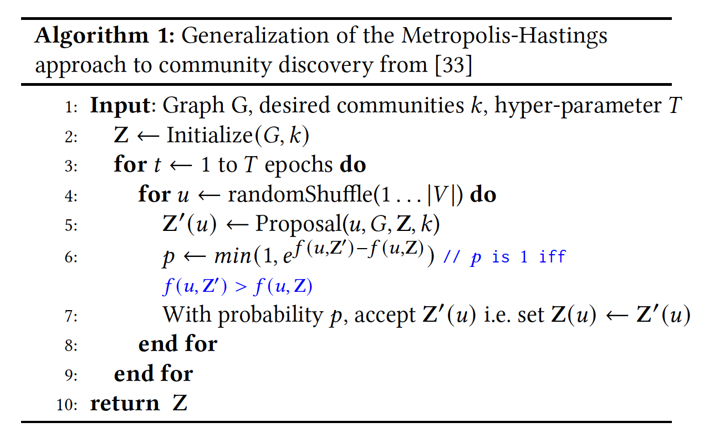
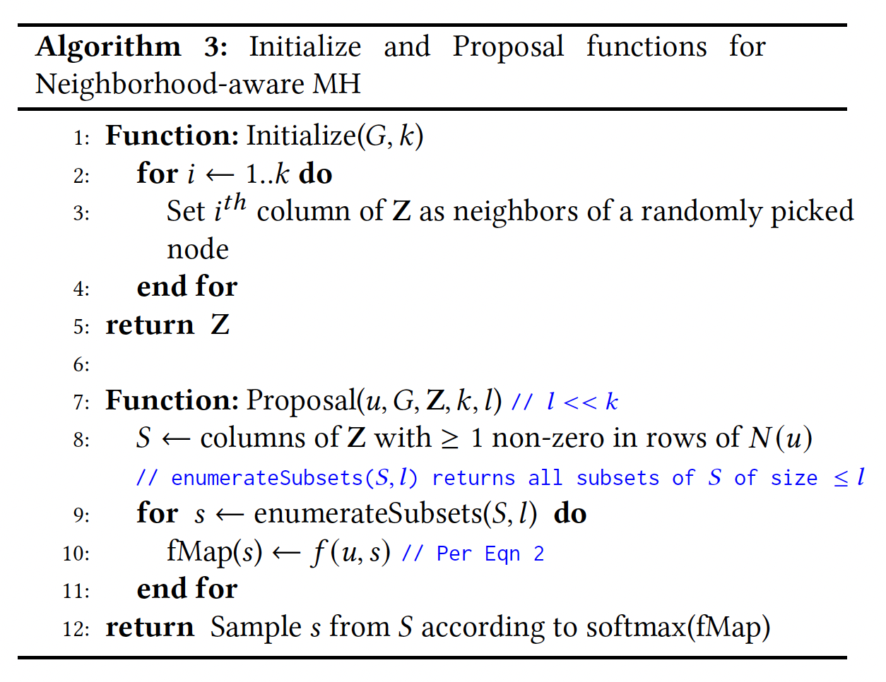

# Reco-sharing

**KDD'2020 - SimClusters: Community-based Representations for Heterogeneous Recommendations at Twitter**

## 1. Before we go into the paper
[Brief introduction about this Twitter repo](../../../../../README.md)

## 2. Background of this paper

On the Twitter platform, there are multitude of content types displayed in a multitude of contexts, requiring a lot of personalization approaches.

challenges:
- The recommendation can be heterogeneous. Users, Tweets, Events, Topics, or hashtags.
- The shelf life of our computed recommendations is closely related to the churn we observe in the recommended content.

requires:   
- Universal representations
- Computational scale with ∼10^9 users, ∼10^11 edges between them, and 10^8 new Tweets every day with ∼10^9 user engagements per day
- Item and graph churn: The modular design of SimClusters makes it easy to extend to dynamic items which rapidly rise and diminish in popularity
- Interpretability: SimClusters representations are sparse and each dimension corresponds to a specific community,

## 3. Overview
SimClusters is as a general-purpose representation layer, generate heterogeneous content sparse embedding, support a multitude of recommendation tasks.

## 4. Brief introduction to Simclusters Algorithm

overall embeddings (user and items) -> all user embeddings -> some important user embeddings

### 4.1 Follow relationships as a bipartite graph 
Follow relationships on Twitter can be used to generate directed graph: 
where each node is a user and each edge represents a Follow. 
Edges are (directed) in that User 1 can follow User 2, User 2 can follow User 1 or both User 1 and User 2 can follow each other.

This directed graph can be also viewed as a bipartite graph, 
where nodes are grouped into two sets, Producers and Consumers. 
In this bipartite graph, Producers are the users who are Followed and Consumers are the Followers. 
Below is a example for four users:

> Figure 1 - Left panel: A directed follow graph; Right panel: A bipartite graph representation of the directed graph

### 4.2 Community Detection - (Known For)
The bipartite follow graph can be used to identify groups of Producers who have similar followers, or who are "Known For" a topic.
Specifically, the bipartite follow graph can also be represented as an *m x n* matrix (*A*), where consumers are presented as *u* and producers are represented as *v*.

We can use cosine similarity between followers to compute Producer-producer similarity.
The resulting cosine similarity values can be used to construct a producer-producer similarity graph. (A smaller size.)

Noise removal is performed, such that edges with weights below a specified threshold are deleted from the graph.

After noise removal has been completed, 
MH(Metropolis-Hastings) sampling-based community detection is then run on the Producer-Producer similarity graph to identify a community affiliation for each producer. 
This algorithm takes in a parameter *k* for the number of communities to be detected.

> Figure 2 -  Left panel: Matrix representation of the follow graph depicted in Figure 1; Middle panel: Producer-Producer similarity is estimated by calculating the cosine similarity between the users who follow each producer; Right panel: Cosine similarity scores are used to create the Producer-Producer similarity graph. A clustering algorithm is run on the graph to identify groups of Producers with similar followers.

Community affiliation scores are then used to construct an *n x k* "Known For" matrix (*V*). This matrix is maximally sparse, and each Producer is affiliated with at most one community. In production, the Known For dataset covers the top 20M producers and k ~= 145000.

> Figure 3 -  The clustering algorithm returns community affiliation scores for each producer. These scores are represented in matrix V.

### 4.3 Consumer Embeddings - User InterestedIn
An Interested In matrix (*U*) can be computed by multiplying the matrix representation of the follow graph (*A*) by the Known For matrix (*V*): 

There is also a noise removal step applied to the Interested In matrix.

### 4.4 Producer Embeddings
When computing the Known For matrix, each producer can only be Known For a single community. Although this maximally sparse matrix is useful from a computational perspective, we know that our users tweet about many different topics and may be "Known" in many different communities. Producer embeddings ( *Ṽ* )  are used to capture this richer structure of the graph.

To calculate producer embeddings, the cosine similarity is calculated between each Producer’s follow graph and the Interested In vector for each community.

For now: we have generated all user embeddings.
- consumer embedding: also called InterestedIn embeddings, to capture consumer's long-term interest. The InterestedIn embeddings is one of our major source for consumer-based tweet recommendations.
- producer embedding: for producer-based tweet recommendations. For example, we can recommend similar tweets based on an account you just followed.

### 4.5 Entity Embeddings
SimClusters can also be used to generate embeddings for different kind of contents, such as
- Tweets (used for Tweet recommendations)
- Topics (used for TopicFollow)

#### 4.5.1 Tweet embeddings
When a tweet is created, its tweet embedding is initialized as an empty vector.
Tweet embeddings are updated each time the tweet is favorited. Specifically, the InterestedIn vector of each user who Fav-ed the tweet is added to the tweet vector.

Tweet embeddings are critical for our tweet recommendation tasks. We can calculate tweet similarity and recommend similar tweets to users based on their tweet engagement history.

We have a online Heron job that updates the tweet embeddings in realtime, check out [here](summingbird/README.md) for more. 

#### 4.5.2 Topic embeddings
Topic embeddings (**R**) are determined by taking the cosine similarity between consumers who are interested in a community and the number of aggregated favorites each consumer has taken on a tweet that has a topic annotation (with some time decay).

Topic is now stop updated.
we copy the previous version of TFG and write to a new one.
The dependent dataset for TFG has been deleted.
Instead of restarting the entire job, we create this temp hacky solution to keep TFG dataset alive until we deprecate topics.
Having a table TFG doesn't lead to a big quality concern b/c TFG is built from topic follows, which is relative stable
and we don't have new topics anymore.

# Appendix

## 1. MH (Metropolis-Hastings sampling)
The method for Community Detection, to generate the KnowFor matrix.
Assume Z_{R*k} is the Known for matrix. row R means the size of producer, k is the size of community.
Objective function:

It means that max the intersection of item and neighbor's community, and minimize the intersection of item and other nodes.

The algorithm is as follows:

The initial algorithm: For example

For the proposal algorithm, there are two insights or assumptions:
- the first is that it is extremely unlikely that a node should belong to a community that none of its neighbors currently belongs to;
- the second is as mentioned before, that for most practical applications, it is unnecessary to assign a node to more than a small number of communities

Important implementation details
- we can incrementally compute the summary statistics required for
  𝑓 (𝑢, 𝑠) as we go through a node’s neighborhood when executing line 8 of Algorithm 3
- Sampling from a softmax distribution can be accomplished efficiently
  in a single pass using the Gumbel-Max trick
- we assign each node to at most one community only
- Parallelization. Specifically the for loop in line 4 of Algorithm 1

[//]: # ()
[//]: # (## 2. SimClusters ANN &#40;optional&#41;)
[//]: # ([simclusters_ANN]&#40;../../../../../simclusters-ann/README.md&#41;)

## 3. Project Directory Overview
The whole SimClusters project can be understood as 2 main components
- SimClusters Offline Jobs (Scalding / GCP)
- SimClusters Real-time Streaming Jobs 

### 3.1 SimClusters Offline Jobs

**SimClusters Scalding Jobs**

| Jobs   | Code                                                                                                                                                         | Description  |
|---|--------------------------------------------------------------------------------------------------------------------------------------------------------------|---|
| KnownFor  | [simclusters_v2/scalding/update_known_for/UpdateKnownFor20M145K2020.scala  (go into this script)](scalding/update_known_for/UpdateKnownFor20M145K2020.scala) | The job outputs the KnownFor dataset which stores the relationships between  clusterId and producerUserId. </n> KnownFor dataset covers the top 20M followed producers. We use this KnownFor dataset (or so-called clusters) to build all other entity embeddings. |
| InterestedIn Embeddings| [simclusters_v2/scalding/InterestedInFromKnownFor.scala](scalding/InterestedInFromKnownFor.scala)                                                            |  This code implements the job for computing users' interestedIn embedding from the  KnownFor dataset. </n> We use this dataset for consumer-based tweet recommendations.|
| Producer Embeddings  | [simclusters_v2/scalding/embedding/ProducerEmbeddingsFromInterestedIn.scala](scalding/embedding/ProducerEmbeddingsFromInterestedIn.scala)                    |  The code implements the job for computer producer embeddings, which represents the content user produces. </n> We use this dataset for producer-based tweet recommendations.|
| Semantic Core Entity Embeddings  | [simclusters_v2/scalding/embedding/EntityToSimClustersEmbeddingsJob.scala](scalding/embedding/EntityToSimClustersEmbeddingsJob.scala)                        | The job computes the semantic core entity embeddings. It outputs datasets that stores the  "SemanticCore entityId -> List(clusterId)" and "clusterId -> List(SemanticCore entityId))" relationships.|
| Topic Embeddings | [simclusters_v2/scalding/embedding/tfg/FavTfgBasedTopicEmbeddings.scala](scalding/embedding/tfg/FavTfgBasedTopicEmbeddings.scala)                            | Jobs to generate Fav-based Topic-Follow-Graph (TFG) topic embeddings </n> A topic's fav-based TFG embedding is the sum of its followers' fav-based InterestedIn. We use this embedding for topic related recommendations.|

Different jobs for different event-based scores:
- favorites
- follow
- retweets, 
- replies
- implicit actions like bookmark, impression, video view

**SimClusters GCP Jobs** (skip)

We have a GCP pipeline where we build our SimClusters ANN index via BigQuery.

All SimClusters related GCP jobs are under [src/scala/com/twitter/simclusters_v2/scio/bq_generation](scio/bq_generation).

| Jobs   | Code  | Description  |
|---|---|---|
| PushOpenBased SimClusters ANN Index  |  [EngagementEventBasedClusterToTweetIndexGenerationJob.scala](scio/bq_generation/simclusters_index_generation/EngagementEventBasedClusterToTweetIndexGenerationJob.scala) | The job builds a clusterId -> TopTweet index based on user-open engagement history. </n> This SANN source is used for candidate generation for Notifications. |
| VideoViewBased SimClusters Index|  [EngagementEventBasedClusterToTweetIndexGenerationJob.scala](scio/bq_generation/simclusters_index_generation/EngagementEventBasedClusterToTweetIndexGenerationJob.scala) |  The job builds a clusterId -> TopTweet index based on the user's video view history. </n> This SANN source is used for video recommendation on Home.|

### 3.2 SimClusters Real-Time Streaming Tweets Jobs (skip)

| Jobs   | Code  | Description  |
|---|---|---|
| Tweet Embedding Job |  [simclusters_v2/summingbird/storm/TweetJob.scala](summingbird/storm/TweetJob.scala) | Generate the Tweet embedding and index of tweets for the SimClusters |
| Persistent Tweet Embedding Job|  [simclusters_v2/summingbird/storm/PersistentTweetJob.scala](summingbird/storm/PersistentTweetJob.scala) |  Persistent the tweet embeddings from MemCache into Manhattan.|